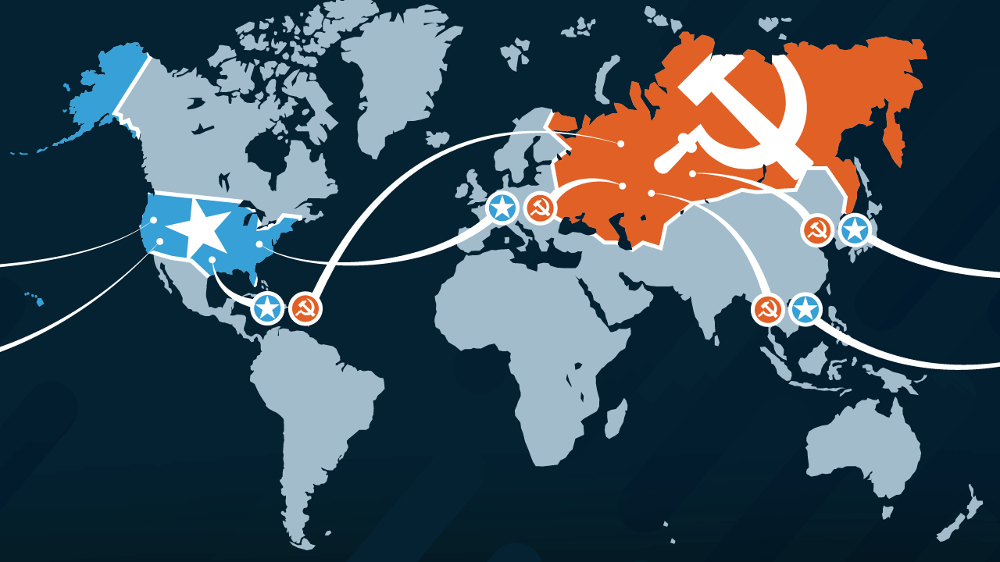
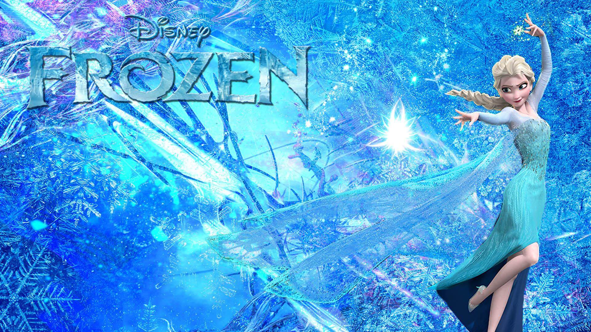
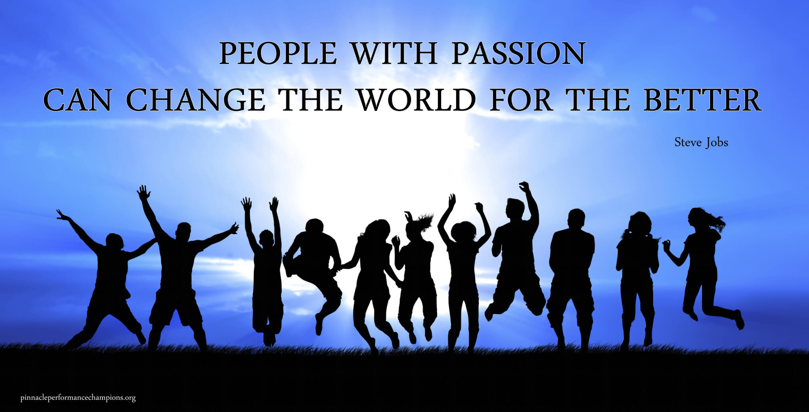

# NASA 555

### A fairy tale

---
@title[Cold War]

note: Image from https://www.prageru.com/videos/what-was-cold-war

+++

@title[Ice War]

note: Not the Ice War! Elsa Frozen.

---

@title[The first satellite]

note: Sputnik is the first satellite in the world by Russia! 1957

+++

@title[The first man in space]

note: Yuri Gagarin with the Vostok 1 by Russia again! 1961

+++

@title[We choose to go to the moon]

note: September 1962, JFK has speech at Rice University.

+++

@title[NASA product I]

+++

@title[NASA product II]

---

## Software Industry Today

* CMMi
* ISO 27001
* ITSQB
* ITIL
* EA
* PMP
* SOA
* etc (CISSP, CCNA, MCP)

+++

### EA

* TOGAF
* Zachman
* IEEE

+++

### SOA

* OASIS
* TOGAF
* IEEE

---

## Agile World

* XP
* Scrum
* DevOps
* Micro Services

---

## Passion is important

note: Image from https://atebabesgardenofquotesmessages.wordpress.com/2016/06/26/10-things-you-should-know-about-passion-2/

---

### Questions?

 

@fa[twitter gp-contact](@tlaothong)

@fa[github gp-contact](tlaothong)

@fa[facebook gp-contact](digitalthailandclub)

---?image=assets/image/gitpitch-audience.jpg&opacity=100

---

